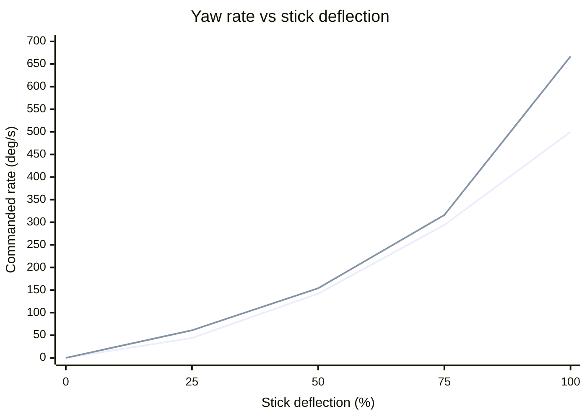
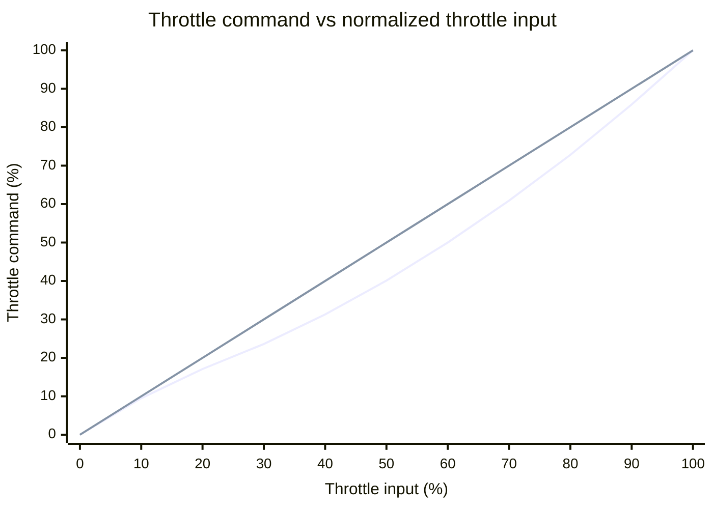

# AIR65 C vs AIR65 R

Comparison of the fleet's AIR65 II Champion (`AIR65 C`) and Air65 Racing (`AIR65 R`). Hardware details come from `hardware.csv`; flight settings come from the latest AIR65 C dump (2026-10-09) and AIR65 R dump (2026-09-29).

## Quick comparison

| | AIR65 C | AIR65 R |
|---|---|---|
| Product | Air65 II Champion edition | Air65 Racing version |
| Cell / wheelbase | 1S / 65 mm | 1S / 65 mm |
| Recorded weight | 16.6 g | 17.3 g |
| Flight controller | Matrix 1S 5IN1 II, built-in 12 A ESC | Air 5-in-1, built-in ESC |
| Betaflight target | `BETAFPVG473_V2` | `BETAFPVG473` |
| Betaflight build | BETAFPV 2026.6.0-alpha, build `e92c10887` | 4.5.0 |
| Gyro | BMI270, confirmed by runtime snapshot | ICM42688, per BETAFPV Air65 Racing firmware record |
| Motors | Champion 0702, 36,000 KV, dual ball bearing | 0702 SE II, 27,000 KV |
| Props | Gemfan GF 1207, 3 blade | Gemfan 1219S, 3 blade |
| Camera / video | C03 / onboard 5.8 GHz VTX, 25–400 mW | C03 / onboard 5.8 GHz VTX, 25–400 mW |
| Receiver | BETAFPV onboard serial ELRS 2.4 GHz; firmware 3.5.6 (`ee188b`), ISM2G4 | Onboard ELRS 2.4 GHz; receiver firmware revision not recorded |

The AIR65 C is 0.7 g lighter in the fleet records, about 4% relative to the AIR65 R. Its motors have a 33% higher KV rating. Those figures indicate different propulsion setups; KV alone does not establish a real-world speed or thrust difference because the motors, props, and airframes differ.

BETAFPV lists the Air65 II Champion with 36,000 KV dual-ball-bearing motors, GF 1207 props, a 12 A Matrix 5IN1 II FC, and 16.6 g weight. Its Air65 Racing page lists 27,000 KV racing motors and GF 1219S props. [Air65 II product specs](https://betafpv.com/products/air65-ii-brushless-whoop-quadcopter), [Air65 product specs](https://betafpv.com/products/air65-brushless-whoop-quadcopter), [Air65 Racing firmware and CLI](https://support.betafpv.com/hc/en-us/articles/32980449219865-CLI-and-Firmware-for-Air65-Racing).

## Current flight setup

| Setting | AIR65 C | AIR65 R |
|---|---|---|
| Receiver protocol | CRSF (serial ELRS) | CRSF (serial ELRS) |
| Motor protocol / bidirectional DShot | DSHOT300 / ON | DSHOT300 / ON |
| Active rate profile | 0 (`-`) | 0 (`R_Angle`) |
| Rates type | ACTUAL | BETAFLIGHT |
| Stored RC rate, roll/pitch/yaw | 7 / 7 / 7 | 100 / 100 / 100 |
| Stored super rate, roll/pitch/yaw | 58 / 58 / 50 | 70 / 70 / 70 |
| Center sensitivity, roll/pitch/yaw | 70 / 70 / 70 deg/s | 200 / 200 / 200 deg/s |
| Maximum rate, roll/pitch/yaw | 580 / 580 / 500 deg/s | 667 / 667 / 667 deg/s |
| Expo, roll/pitch/yaw | 0 / 0 / 0 | 0 / 0 / 0 |
| Throttle mid / expo | 28 / 35 | 50 / 0 |
| Throttle hover point | 22% output at 28% input | Not used by Betaflight 4.5.0 curve |
| Throttle limit | OFF (100%) | OFF (100%) |
| Crash Recovery | ON in all four PID profiles | ON in profiles 0–1; OFF in profiles 2–3 |
| Air Mode | ON via AUX mode; permanent `feature AIRMODE` disabled | ON via AUX mode |
| Modes | Same assignments and AUX ranges | Same assignments and AUX ranges |

Both quads use ARM on AUX1 low (900–1300), ANGLE on AUX2 high (1700–2100), Flip Over After Crash on AUX2 middle (1300–1700), Air Mode on AUX2 low (900–1300), Beeper on AUX3 from 1300–2100, and VTX Pit Mode on AUX4 from 1300–2100. AIR65 C's current dump has `feature -AIRMODE`, so the AUX2 range controls Air Mode rather than it being permanently active.

Both have Crash Recovery enabled in their active PID profile, with the same recorded settings: D threshold 50, gyro threshold 400, setpoint threshold 350, time 500 ms, delay 0 ms, recovery angle 10 degrees, recovery rate 100, and yaw limit 200. AIR65 C has it enabled across all four PID profiles; AIR65 R has it enabled only in profiles 0 and 1.

### Rate curves

Each chart compares commanded angular rate with stick deflection. In each chart, the **first line is AIR65 C** and the **second line is AIR65 R**. Rates are sampled from the profiles in the latest dumps and calculated with the repository's [Betaflight rate decoder](../.agents/skills/fpv-fleet-update/scripts/rates.py); they are not flight measurements. The x-axis points are 0%, 25%, 50%, 75%, and 100% stick deflection.

#### Roll

#### Pitch

#### Yaw

| Stick deflection | AIR65 C roll/pitch | AIR65 R roll/pitch | AIR65 C yaw | AIR65 R yaw |
|---:|---:|---:|---:|---:|
| 0% (center sensitivity) | 70 | 200 | 70 | 200 |
| 25% | 49 | 61 | 44 | 61 |
| 50% | 162 | 154 | 142 | 154 |
| 75% | 339 | 316 | 294 | 316 |
| 100% (maximum) | 580 | 667 | 500 | 667 |

AIR65 C is less sensitive near center and at 25% stick, but its roll/pitch rate is slightly higher around 50–75% stick. At full stick it tops out below AIR65 R, especially on yaw. The profiles use different rate models, so matching just their maximum rates would not make their curves feel the same. The current C profile is the previous `ACTUAL` profile, restored after the `whoop-race` BETAFLIGHT profile felt unsuitable. The fleet tracker still records `whoop-race` as its assigned target and flags the current rates as different. The latest dump shows throttle curve values unchanged from the earlier C dump; this comparison alone cannot explain a reported launch/climb issue.

### Throttle curve preview

This preview uses the active rate profiles from the latest dumps. The x-axis is normalized throttle input after Betaflight's `min_check` mapping; the y-axis is Betaflight's normalized throttle command (`rcCommand[THROTTLE]`). AIR65 C's firmware source (`e92c10887`) builds a 12-point curve from `thr_mid=28`, `thr_expo=35`, and `thr_hover=22`, then interpolates between points. AIR65 R runs Betaflight 4.5.0, where its `thr_mid=50` and `thr_expo=0` make the legacy curve linear. The chart is a software command preview, not motor output, RPM, or thrust. [AIR65 C firmware curve implementation](https://github.com/betaflight/betaflight/blob/e92c10887/src/main/fc/rc.c), [Betaflight 4.5.0 curve implementation](https://github.com/betaflight/betaflight/blob/4.5.0/src/main/fc/rc.c).

In this chart, the **first line is AIR65 C** and the **second line is AIR65 R**.

| Throttle input | AIR65 C command | AIR65 R command |
|---:|---:|---:|
| 10% | 9.5% | 10% |
| 20% | 17.1% | 20% |
| 25% | 20.2% | 25% |
| 28% (C's `thr_mid`) | about 22.1% | 28% |
| 30% | 23.6% | 30% |
| 50% | 40.1% | 50% |
| 75% | 66.7% | 75% |
| 100% | 100% | 100% |

AIR65 C's curve stays below the linear AIR65 R curve through most of the range; it does not add extra throttle at low stick. Its `throttle_limit_type` is OFF, so full input still permits full throttle command. Because this curve is the same before and after the rate change, the rate-profile update did not change the throttle curve. A strong climb can still happen at a modest throttle command because this chart does not model how the motors and props turn that command into thrust. Check the live Receiver-tab throttle value and radio endpoints/mixes if the climb is abrupt.

## Practical differences

- **AIR65 C:** newer Matrix II electronics, the lighter Champion frame, higher-KV dual-ball-bearing motors, and the vendor's newer Betaflight build. BETAFPV says compatible firmware is needed for some IMU variants; retain firmware matched to the installed BMI270 and `BETAFPVG473_V2` target.
- **AIR65 R:** earlier Air 5-in-1 electronics, lower-KV SE II motors, and Betaflight 4.5.0 on `BETAFPVG473`.
- **Video channel:** both latest dumps record 5917 MHz (Raceband 8). Confirm that channel is clear before flying together.
- **Core flight behavior:** mode assignments and Crash Recovery are aligned. The main recorded tuning difference is the rate profile.

The two targets and firmware builds differ, so do not cross-flash firmware or blindly restore one quad's full CLI dump onto the other.

## Source records

- AIR65 C current: `backups/BTFL_cli_AIR65_C_20261009_141531_BETAFPVG473_V2.txt` (rates rolled back); preceding rates change: `backups/BTFL_cli_AIR65_C_20261009_140652_BETAFPVG473_V2.txt`; hardware and runtime notes in `hardware.csv`.
- AIR65 R: `backups/BTFL_cli_AIR65_R_20260929_153410_BETAFPVG473.txt`; hardware details in `hardware.csv`.
- Generated fleet views: `fpv_quads_latest.csv`, `rates.csv`, `modes.csv`, and `racing_whoops.csv`.
