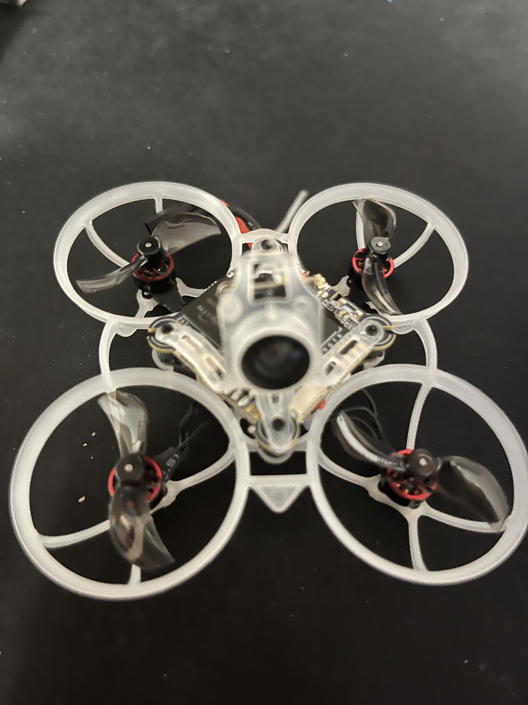
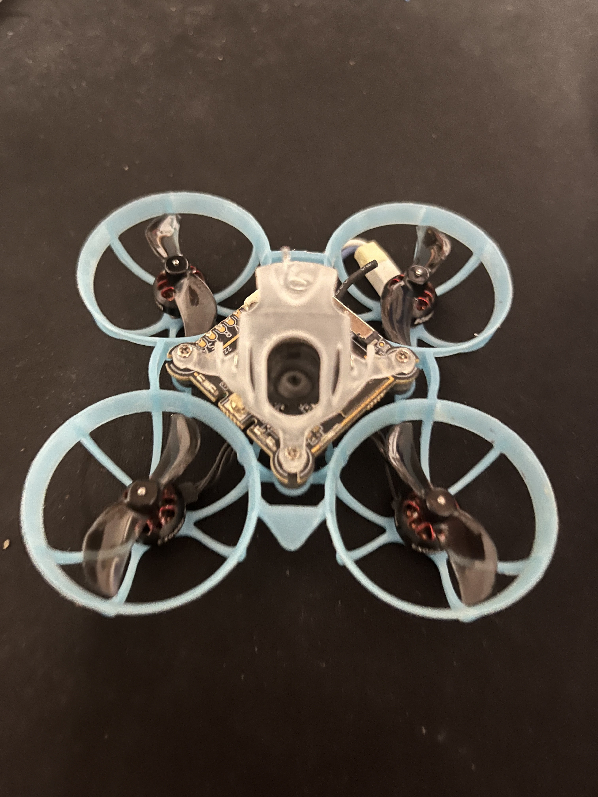
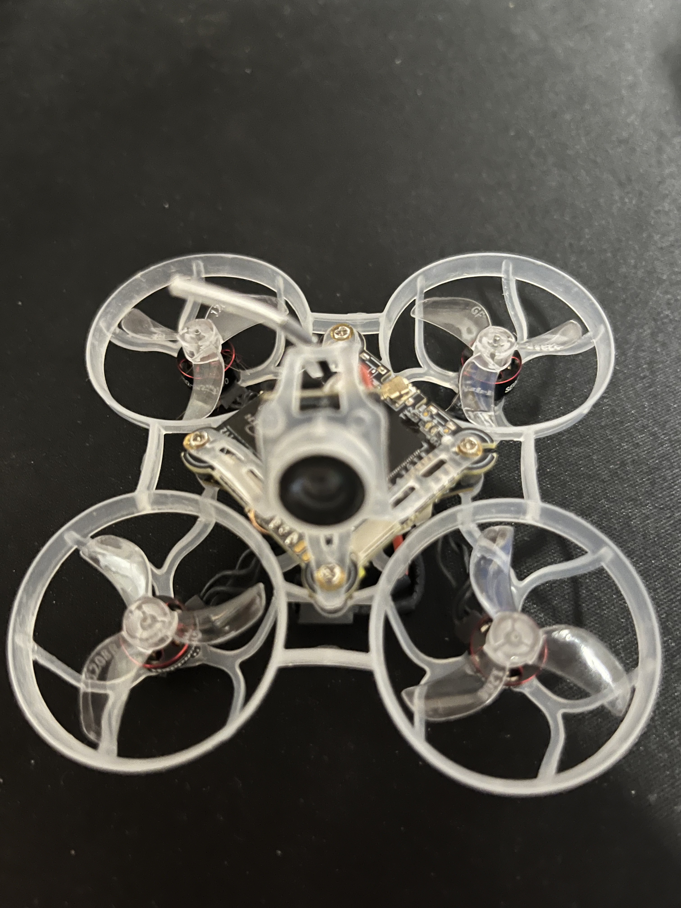
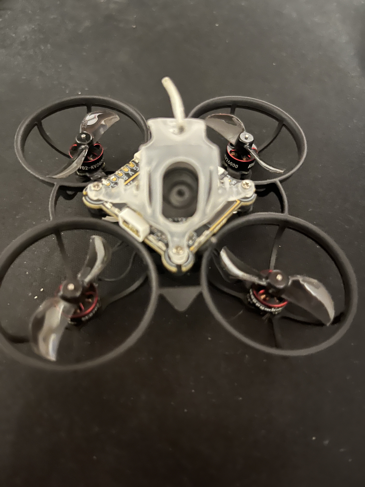
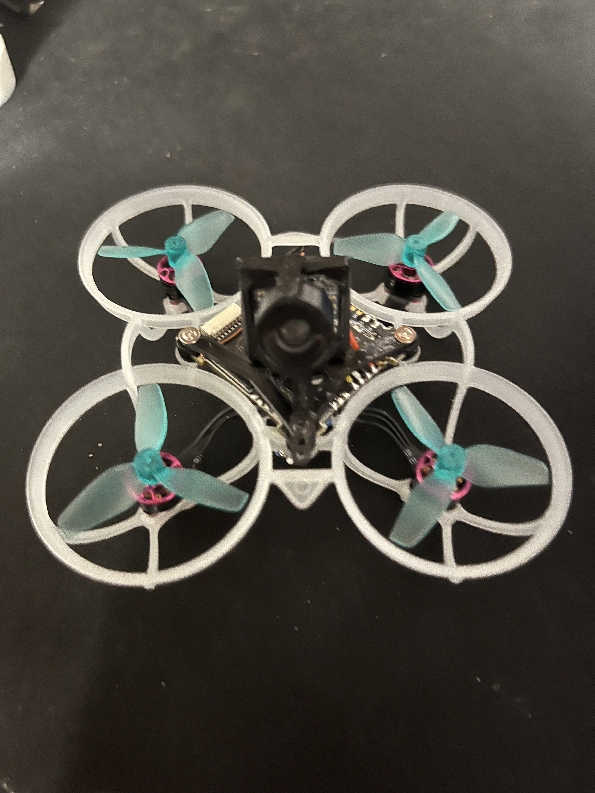

# Whoop pictures

JPG conversions are provided in [`jpg/`](jpg/) for broad image-viewer compatibility. The original HEIC, JPG, and PNG files are retained in the parent folder.

## Racing-whoop inventory

The canonical racing-whoop inventory is [`../racing_whoops.csv`](../racing_whoops.csv). It currently
contains these eight curated race-class whoops:

For each pictured racing whoop below, the inventory details are shown immediately above its image.
The CSV also records the flight controller board, decoded rates at centre/max and 25/50/75% stick,
crash-recovery settings, and the source CLI dump filename.

## Images

### Air65 R

17.3g · 0702 SE II 27000KV · Gemfan 1219S 3-blade · Betaflight 4.5.0 · Airmode ON

### Diamond Legacy

Former Diamond Mobeetle6, now tracked separately as `Diamond Legacy`. No picture is currently
available.

### Ecofree

23g · 0702 BetaFPV 30000KV · Gemfan Durable 1210 31mm bi-blade · Betaflight 4.4.2 · Airmode ON

### Happish

28g · EX0802 19000KV · Gemfan 35mm 2-blade · Betaflight 4.4.2 · Airmode ON

### Diamond

23.16g · SE 0702 28000KV · Gemfan 1208-3 31mm tri-blade · Betaflight 4.4.2 · Airmode ON

### Mob6 AIO5 1st

19g · SE 0702 28000KV · HQ ultralight 1.2x1.1x3 tri-blade · Betaflight 4.4.2 · Airmode ON

No picture is currently available.

### Mob6 2nd

19g · SE 0702 28000KV · HQ ultralight 1.2x1.1x3 tri-blade · Betaflight 4.5.2 · Airmode ON

### Mobula1

29.5g · EX 1002 20000KV · Gemfan 31mm bi-blade · Betaflight 4.4.2 · Airmode ON

### Race33

18.6g · 0702 30000KV · HQ ultralight 1.2x1.1x3 tri-blade · Betaflight 4.5.1 · Airmode ON

